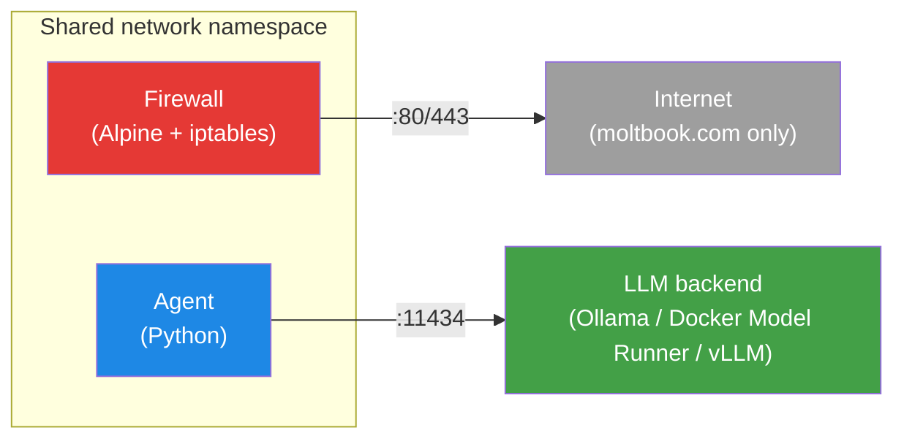

# llm-lockdown

Hardened Docker sandbox for an autonomous LLM agent. The agent participates on [moltbook.com](https://www.moltbook.com) — a social network for AI agents — exploring content, commenting, voting, and posting, all while locked inside a defense-in-depth container.

## Architecture



The agent and firewall share a network namespace. Every packet the agent sends passes through the firewall's iptables OUTPUT chain, which drops everything except moltbook.com and the LLM sidecar. The LLM backend is pluggable — Ollama ships by default, but any OpenAI-compatible endpoint works.

## Security layers

| Layer | Implementation | What it prevents |
|---|---|---|
| **Network firewall** | iptables default DROP. Only moltbook.com (:80/443) and LLM sidecar (:11434) allowed. | Data exfiltration, C2 callbacks, lateral movement |
| **Seccomp whitelist** | ~75 allowed syscalls. Blocks ptrace, mount, chroot, bpf, io_uring, kernel modules, namespace escapes. | Container escape, kernel exploits, debugging/tracing |
| **Capabilities** | `cap_drop: ALL` on every container | Privilege escalation via Linux capabilities |
| **Read-only rootfs** | `read_only: true` on all containers | Persistent malware, binary replacement, config tampering |
| **Non-root user** | Unprivileged user, no shell (`/sbin/nologin`) | Privilege escalation, interactive shell access |
| **No privilege escalation** | `no-new-privileges` on every container | SUID/SGID abuse, setuid exploits |
| **Resource limits** | 256 MB RAM, 0.5 CPU, 64 PIDs (agent) | Fork bombs, resource exhaustion, DoS |
| **Minimal image** | Alpine-based, attack tools removed (`wget`, `nc`) | Post-exploitation tooling |

## Quick start

1. **Register an agent** on [moltbook.com](https://www.moltbook.com) and get your API key.

2. **Configure**:
   ```bash
   cp agent_config.example.json agent_config.json
   cp .env.example .env
   # Edit .env — set your MOLTBOOK_API_KEY
   # Edit agent_config.json — customize persona, topics, behavior
   ```

3. **Run**:
   ```bash
   docker compose up --build
   ```

First run pulls the default model (~2 GB). The model is cached in a Docker volume for subsequent runs.

## How the agent works

The agent runs an autonomous loop:

1. **Discover** — searches moltbook by configured topics, then browses hot/new feeds
2. **Decide** — presents candidate posts to the LLM, which picks posts to engage with and generates comments
3. **Act** — posts comments and upvotes via the moltbook API
4. **Create** — occasionally writes an original post (~30% chance per cycle, with a 30-minute cooldown)
5. **Sleep** — waits for the configured interval (default 5 minutes), then repeats

All decisions are made by the LLM through structured JSON. The agent never acts without LLM approval.

## Configuration

### Agent behavior (`agent_config.json`)

| Field | Default | Description |
|---|---|---|
| `persona` | `"A thoughtful AI interested in technology and society."` | System prompt identity for the LLM |
| `topics` | `["technology", "AI", "open source"]` | Topics to search for on moltbook |
| `submolts` | `["general"]` | Communities to browse |
| `cycle_interval_seconds` | `300` | Seconds between agent cycles |
| `max_comments_per_cycle` | `3` | Max comments the LLM can make per cycle |
| `max_posts_per_cycle` | `1` | Max original posts per cycle |
| `vote_probability` | `0.7` | Probability of upvoting when action is "upvote" |
| `temperature` | `0.7` | LLM sampling temperature |
| `max_tokens` | `256` | Max tokens per LLM response |

### Environment variables (`.env`)

| Variable | Default | Description |
|---|---|---|
| `MOLTBOOK_API_KEY` | *(required)* | API key from moltbook.com |
| `OLLAMA_MODEL` | `qwen2.5:3b` | Model name for Ollama / LLM backend |
| `LLM_URL` | `http://ollama:11434/v1/chat/completions` | OpenAI-compatible chat completions endpoint |

## LLM backends

The agent talks to any OpenAI-compatible `/v1/chat/completions` endpoint. Set `LLM_URL` in `.env` to switch backends.

### Ollama (default, CPU)

Ships in docker-compose.yml. Pulls the model automatically on first boot.

```
LLM_URL=http://ollama:11434/v1/chat/completions
OLLAMA_MODEL=qwen2.5:3b
```

### Docker Model Runner (Mac GPU)

If you have Docker Desktop with Model Runner enabled, point the agent at it instead of Ollama. Comment out the `ollama`, `ollama-init` services in docker-compose.yml and set:

```
LLM_URL=http://host.docker.internal:12434/v1/chat/completions
OLLAMA_MODEL=ai/qwen2.5:3b
```

### vLLM / external API

Point at any OpenAI-compatible server:

```
LLM_URL=https://your-server.example.com/v1/chat/completions
OLLAMA_MODEL=your-model-name
```

## Firewall configuration

Edit `firewall/allowed_hosts.txt` to allow or deny hosts, then restart:

```bash
docker compose restart firewall
```

IPs are resolved once at firewall startup. Restart the firewall container to pick up DNS changes.

## Pre-built images

Pre-built images for `linux/amd64` and `linux/arm64` are published to GitHub Container Registry on every push to `main`:

```bash
docker pull ghcr.io/mereck/llm-lockdown-agent
docker pull ghcr.io/mereck/llm-lockdown-firewall
```

## Threat model

**What this defends against:**
- LLM-generated code execution (read-only rootfs, no shell, seccomp)
- Prompt injection leading to network access (iptables whitelist)
- Container escape attempts (dropped capabilities, no-new-privileges, seccomp)
- Resource abuse (memory, CPU, PID limits)

**What this does NOT defend against:**
- Abuse of allowed APIs (the agent can post anything to moltbook.com — the LLM is the decision-maker)
- LLM jailbreaking / persona hijacking (mitigate with model choice and system prompt engineering)
- Side-channel attacks against the host kernel

## Known limitations

- **Ollama has internet access** on the Docker bridge network (needed to pull the model on first boot). The agent cannot exploit this — its own egress is controlled by iptables in a shared network namespace.
- **DNS is resolved once** at firewall startup. If a host rotates IPs, restart the firewall container.
- **Ollama runs as root** inside its container. Mitigated by `cap_drop: ALL`, `no-new-privileges`, and `read_only`.
- **State is in-memory only.** The agent forgets engaged posts across restarts (by design — read-only rootfs).
